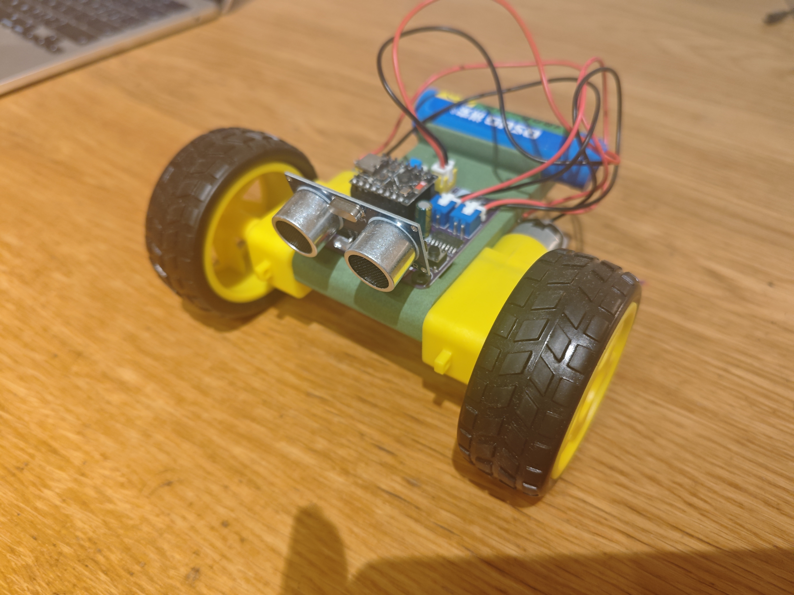

# PiCar Mini 2WD

Low-cost **2WD smart car** with **ESP32-C3 SuperMini** + integrated **driver board v1.1**, programmed in **MicroPython**.

低成本二驱智能小车：ESP32-C3 SuperMini + 自制驱动板 v1.1，MicroPython 编程。



## Features

- Dual TT motors, TC1508A H-bridge, PWM speed / direction
- Board LEDs: left red (GPIO5), right green (GPIO6)
- Soft buttons SW21 (left) / SW20 (right), active-low
- HC-SR04 ultrasonic (Trig=GPIO7, Echo=GPIO10)
- Plug-in MCU header; XH2.54 motor / battery connectors
- ~¥35–40 BOM for classroom kits (depending on sourcing)

## Quick start

1. Flash MicroPython (`ESP32_GENERIC_C3`) — see [docs/flashing.md](docs/flashing.md)
2. Run `firmware/micropython/chapter-01/hello.py`, then `chapter-02/blink_led.py`
3. Follow the 8-chapter tutorial online or under `firmware/micropython/chapter-*`

**Power tip:** plug USB to the C3 first, then enable the battery switch.

## Documentation

| Doc | Content |
| --- | --- |
| [docs/overview.md](docs/overview.md) | System overview |
| [docs/pinout.md](docs/pinout.md) | GPIO map |
| [docs/bom.md](docs/bom.md) | Bill of materials |
| [docs/assembly.md](docs/assembly.md) | Assembly & power-up |
| [docs/flashing.md](docs/flashing.md) | Firmware flashing |
| [hardware/README.md](hardware/README.md) | Driver board |
| [firmware/README.md](firmware/README.md) | MicroPython examples |

## Website

- Project page: https://www.pythonguru.cn/research/picar-mini-2wd-v1-1/
- Tutorial: https://www.pythonguru.cn/research/picar-mini-2wd-v1-1/micropython-2wd-tutorial/
- Author site: https://www.pythonguru.cn/homepage.html

## Preprint

- **Preprints.org:** [PiCar Mini 2WD: A Strap-Safe, Open MicroPython Lab Stack for Low-Cost 2WD Robotics Education](https://www.preprints.org/manuscript/202608.1857/v1)
- **DOI:** https://doi.org/10.20944/preprints202608.1857.v1
- Manuscript ID: `202608.1857/v1` (Posted 2026-08-26)

```
Liu, Q.; Sun, Z.; Peng, H.; An, X.; Lu, S.; Li, B.; Yang, Q.
PiCar Mini 2WD: A Strap-Safe, Open MicroPython Lab Stack for Low-Cost 2WD Robotics Education.
Preprints 2026, 202608.1857.v1. https://doi.org/10.20944/preprints202608.1857.v1
```

## Cite / Zenodo DOI

[](https://doi.org/10.5281/zenodo.22088329)

- **Version DOI (v1.1.0):** https://doi.org/10.5281/zenodo.22088329  
- **Concept DOI (all versions):** https://doi.org/10.5281/zenodo.22088328  
- Record: https://zenodo.org/records/22088329  
- Citation file: [CITATION.cff](CITATION.cff)

```
Liu, Q., Sun, Z., Peng, H., An, X., Lu, S., Li, B., & Yang, Q. (2026).
PiCar Mini 2WD: Open ESP32-C3 MicroPython Educational Robot (driver board v1.1) (v1.1.0).
Zenodo. https://doi.org/10.5281/zenodo.22088329
```

## Repository layout

```
picar-mini-2wd/
├── docs/           # Design & how-to (Chinese primary)
├── hardware/       # Schematic PDF, BOM CSV, gerber placeholder
├── firmware/       # MicroPython chapters + lib/
└── images/         # Photos & diagrams (English filenames)
```

## Licence

| Part | Licence |
| --- | --- |
| Software / firmware (`firmware/`) | [MIT](LICENSE) |
| Hardware design (`hardware/`) | [CERN-OHL-P-2.0](LICENSE-HARDWARE) |

See [NOTICE.md](NOTICE.md) for third-party trademarks.

## Tag

Hardware / docs in this tree target **driver board v1.1**. Use git tags (e.g. `v1.1`) for releases.
