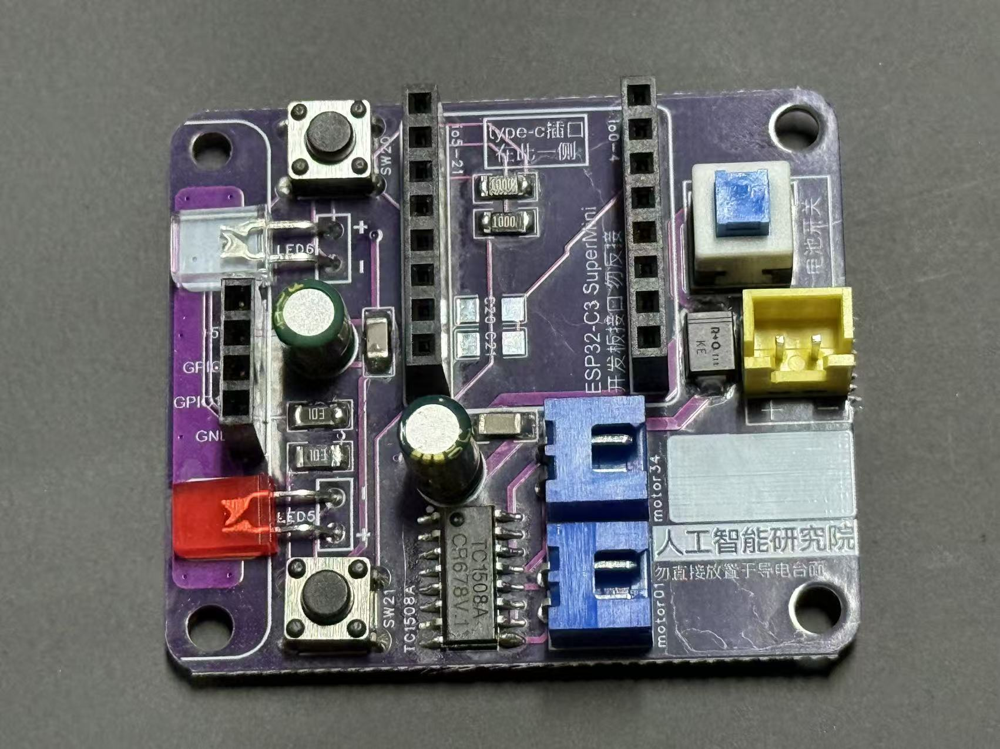

# 装配与上电（Assembly）

## 机械

1. 将两只 TT 电机与驱动轮固定到底盘，安装万向轮。  
2. 固定驱动板；主控 **ESP32-C3 SuperMini** 插入 1×8×2 排母（核对丝印，勿反插）。  
3. 电机线接到 **motor01（左）** / **motor34（右）**（XH2.54）。  
4. 超声波插入板载 4P（注意 Trig / Echo 方向）。  
5. 电池 XH2.54 接到 3.7VBAT / GND（红正黑负，上电前用表确认）。

## 电气注意

- 焊接 / 上电前核对 3.7VBAT 与 GND，避免反接或短路。  
- 电机驱动与逻辑共 3.7VBAT 轨；板载已做防护与去耦。  
- **调试上电顺序：先将 USB 插到 C3，再拨开电池开关。** 异常时短按 RESET。  
- USB 线须支持数据传输。

## 方位约定（软件与实物一致）

- 左：SW21 + 红色 LED5  
- 右：SW20 + 绿色 LED6  

详见 [pinout.md](pinout.md)。
