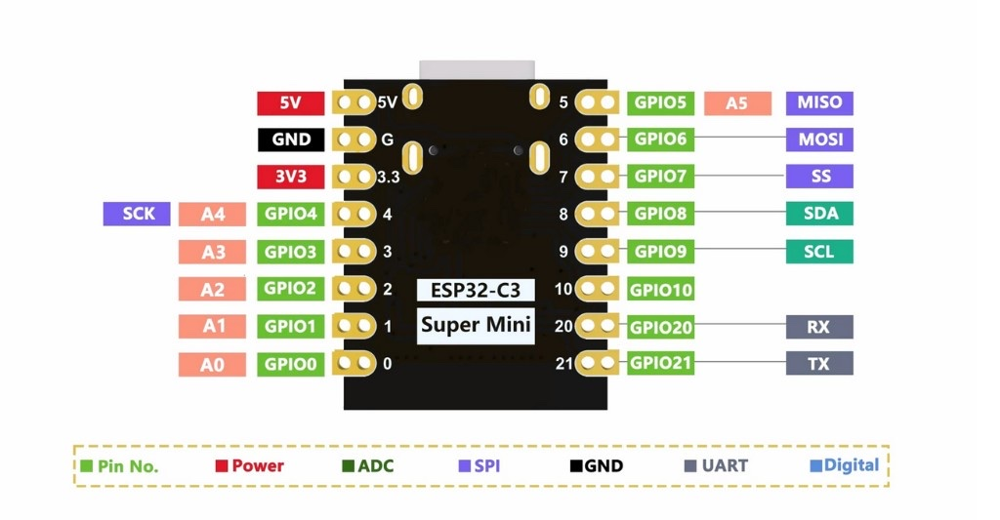

# GPIO 与接线（Pinout）

本车外设 GPIO **以下表为准**。插接 SuperMini 时请与驱动板排母丝印核对，勿反插。

## 引脚分配（实物实测）

| GPIO | 用途 | 状态 |
| --- | --- | --- |
| GPIO0 | 左轮 motor1 一路 | 已分配（C3 上非 strap） |
| GPIO1 | 左轮 motor1 一路 | 已分配 |
| GPIO2 | 空闲（strap，保持悬空） | 慎用 |
| GPIO3 | 右轮 motor2 — INB | 已分配 |
| GPIO4 | 右轮 motor2 — INA | 已分配 |
| GPIO5 | LED5 红色（左侧） | 已分配，高电平点亮 |
| GPIO6 | LED6 绿色（右侧） | 已分配，高电平点亮 |
| GPIO7 | 超声波 Trig | 已分配 |
| GPIO8 | 空闲（strap） | 慎用 |
| GPIO9 | 空闲（strap，BOOT） | 慎用 |
| GPIO10 | 超声波 Echo | 已分配 |
| GPIO20 | SW20 右侧按键（低有效） | 已分配 |
| GPIO21 | SW21 左侧按键（低有效） | 已分配 |

## 电机

| 电机 | 位置 | GPIO（pin1 / pin2） |
| --- | --- | --- |
| motor1 | 左轮 | GPIO1 / GPIO0 |
| motor2 | 右轮 | GPIO4 / GPIO3 |

方向约定（软件）：`pin1=PWM、pin2=0` 为正转（前进）。

## LED / 按键方位

| 方位 | 按键 | LED |
| --- | --- | --- |
| 左 | SW21 (GPIO21) | LED5 红 (GPIO5) |
| 右 | SW20 (GPIO20) | LED6 绿 (GPIO6) |

按键：`Pin(n, Pin.IN, Pin.PULL_UP)`，按下 `value()==0`。

## 超声波

- Trig = **GPIO7**，Echo = **GPIO10**（不可对调）
- 模块需 3.3 V–5 V 宽电压版本更稳妥

## Strap 脚

ESP32-C3 的 strap 脚为 **GPIO2 / GPIO8 / GPIO9**。本驱动板将外设避开这三个脚；说明见 [../firmware/notes/strap-pins.md](../firmware/notes/strap-pins.md)。
